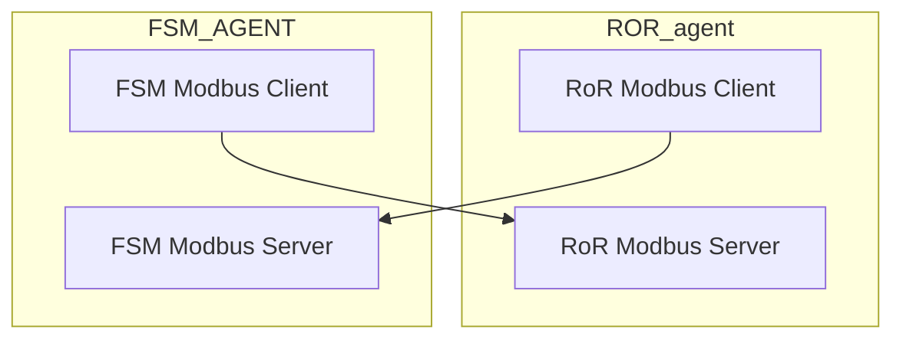

<!--START_SECTION:waka-->


**🐱 Mes données GitHub** 

> 🏆 500 contributions en 2020
 > 
> 📦 0 Bytes utilisés dans le stockage de GitHub 
 > 
> 💼 A choisi d'embaucher
 > 
> 📜 27 référentiels publics
 > 
> 🔑 0 référentiel privé 
 > 
**I'm a Night 🦉** 

```text
🌞 Matin      70 commits     ███░░░░░░░░░░░░░░░░░░░░░░   15.32% 
🌆 Jour       147 commits    ████████░░░░░░░░░░░░░░░░░   32.17% 
🌃 crépuscule 129 commits    ███████░░░░░░░░░░░░░░░░░░   28.23% 
🌙 Nuit       111 commits    ██████░░░░░░░░░░░░░░░░░░░   24.29%

```
📅 **Je suis le plus productif dimanche** 

```text
Lundi        64 commits     ███░░░░░░░░░░░░░░░░░░░░░░   14.0% 
Mardi        64 commits     ███░░░░░░░░░░░░░░░░░░░░░░   14.0% 
Mercredi     51 commits     ██░░░░░░░░░░░░░░░░░░░░░░░   11.16% 
Jeudi        64 commits     ███░░░░░░░░░░░░░░░░░░░░░░   14.0% 
Vendredi     61 commits     ███░░░░░░░░░░░░░░░░░░░░░░   13.35% 
samedi       50 commits     ██░░░░░░░░░░░░░░░░░░░░░░░   10.94% 
dimanche     103 commits    █████░░░░░░░░░░░░░░░░░░░░   22.54%

```


📊 **Cette semaine, je passe mon temps** 

```text
⌚︎ fuseau horaire: Asia/Kolkata

💬 Langages de programmation: 
JavaScript               8 hrs 10 mins       ██████████████░░░░░░░░░░░   56.72% 
Dart                     2 hrs 2 mins        ███░░░░░░░░░░░░░░░░░░░░░░   14.16% 
Java                     1 hr 21 mins        ██░░░░░░░░░░░░░░░░░░░░░░░   9.4% 
YAML                     47 mins             █░░░░░░░░░░░░░░░░░░░░░░░░   5.48% 
JSON                     43 mins             █░░░░░░░░░░░░░░░░░░░░░░░░   5.05%

🔥 Éditeurs de code: 
WebStorm                 9 hrs 13 mins       ████████████████░░░░░░░░░   64.07% 
Android Studio           5 hrs 10 mins       █████████░░░░░░░░░░░░░░░░   35.88% 
PhpStorm                 0 secs              ░░░░░░░░░░░░░░░░░░░░░░░░░   0.05%

🐱‍💻 projets: 
airline-module           6 hrs 51 mins       ████████████░░░░░░░░░░░░░   47.59% 
invoice_app              2 hrs 29 mins       ████░░░░░░░░░░░░░░░░░░░░░   17.24% 
E-Invoice Verify         1 hr 20 mins        ██░░░░░░░░░░░░░░░░░░░░░░░   9.31% 
cable_socket             1 hr 15 mins        ██░░░░░░░░░░░░░░░░░░░░░░░   8.74% 
invoice_app_1            1 hr 3 mins         █░░░░░░░░░░░░░░░░░░░░░░░░   7.39%

💻 système opérateur: 
Windows                  14 hrs 24 mins      █████████████████████████   100.0%

```

**Je code principalement dans Vue** 

```text
Vue                      8 repos             ██████░░░░░░░░░░░░░░░░░░░   24.24% 
Java                     6 repos             ████░░░░░░░░░░░░░░░░░░░░░   18.18% 
JavaScript               6 repos             ████░░░░░░░░░░░░░░░░░░░░░   18.18% 
Dart                     3 repos             ██░░░░░░░░░░░░░░░░░░░░░░░   9.09% 
PHP                      3 repos             ██░░░░░░░░░░░░░░░░░░░░░░░   9.09%

```


<!--END_SECTION:waka-->


---

- hello
- world

